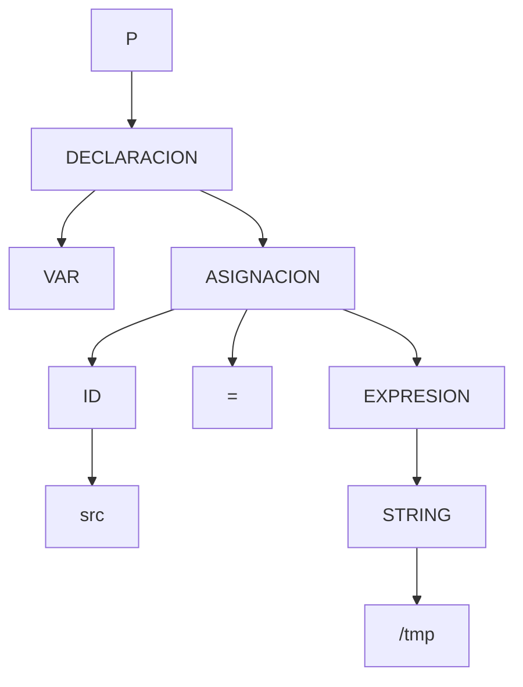

# TP 3 — Árbol y Derivaciones de la cadena `VAR src = "/tmp"`

## Programa de entrada

```
VAR src = "/tmp"
```
---
## BNF correspondiente

```bnf
<programa> ::= <declaracion>

<declaracion> ::= "VAR" <asignacion>

<asignacion> ::= <identificador> "=" <expresion>

<expresion> ::= <string>
```

---
## Gramática utilizada

### GIC = ⟨V, Σ, S, P⟩

- **V (No terminales)** = { P, DECLARACION, ASIGNACION, EXPRESION }  
- **Σ (Terminales)** = { VAR, ID, EQUALS (=), STRING }  
- **S (Símbolo inicial)** = P  
- **P (Producciones):**
  1. P → DECLARACION  
  2. DECLARACION → VAR ASIGNACION  
  3. ASIGNACION → ID EQUALS EXPRESION  
  4. EXPRESION → STRING  

---

## Árbol de Derivación (Gráfico)



---

## ASD — Derivación por la izquierda (descendente)

| Cadena de derivación obtenida | Próxima producción a aplicar     |
|-------------------------------|----------------------------------|
| P                             | P → DECLARACION                  |
| DECLARACION                   | DECLARACION → VAR ASIGNACION     |
| VAR ASIGNACION                | ASIGNACION → ID EQUALS EXPRESION |
| VAR ID EQUALS EXPRESION       | EXPRESION → STRING               |
| VAR ID EQUALS STRING          | Sustituir ID → src               |
| VAR src EQUALS STRING         | Sustituir EQUALS → =             |
| VAR src = STRING              | Sustituir STRING → "/tmp"        |
| VAR src = "/tmp"              | accept                           |


**Resultado:**  
✅ La cadena `VAR src = "/tmp"` se deriva correctamente **por la izquierda** (análisis descendente).

---

## ASA — Derivación por la derecha (ascendente)

| Cadena de derivación obtenida | Próxima producción a aplicar     |
|-------------------------------|----------------------------------|
| VAR src = "/tmp"              | "/tmp" → STRING                  |
| VAR src = STRING              | STRING → EXPRESION               |
| VAR src = EXPRESION           | ID → src                         |
| VAR ID = EXPRESION            | EQUALS → =                       |
| VAR ID EQUALS EXPRESION       | ID EQUALS EXPRESION → ASIGNACION |
| VAR ASIGNACION                | VAR ASIGNACION → DECLARACION     |
| DECLARACION                   | DECLARACION → P                  |
| P                             | accept                           |

**Resultado:**  
✅ La cadena `VAR src = "/tmp"` es reconocida correctamente **por la derecha** (análisis ascendente).

---


## Conclusión

- La palabra `VAR src = "/tmp"` pertenece al lenguaje.  
- Es generada tanto por la derivación **izquierda (ASD)** como **derecha (ASA)**.  